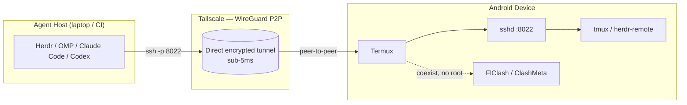

# termux-agent-station

[English](README.md) | [简体中文](README.zh-CN.md)

> **Turn any Android phone into a sub-5ms low-latency mobile workstation for AI coding agents via Tailscale & Herdr.**

`termux-agent-station` transforms a spare Android device running Termux into a persistent, battery-friendly, native-SSH workstation that AI coding agents (Herdr, OMP, Claude Code, Codex) can drive over a WireGuard peer-to-peer link — no cloud relay, no screen-streaming, no compromise.

---

## Why this exists

### The problem with "remote phone coding" today
Most people who try to code on a phone fall back to one of two traps:

- **WebRTC / VNC screen streaming** — laggy, battery-hungry, and cursed with terrible keyboard UX. Every keystroke is a pixel round-trip; every color is transcoded; every reconnect loses your place.
- **Cloud IDEs** — your code leaves the device, latency is at the mercy of the cellular network, and you pay for the privilege.

### The native approach
Termux already gives you a full Linux userspace on Android. Pair it with **Tailscale** (WireGuard under the hood) and **native SSH**, and you get:

- ⚡ **Sub-5ms direct latency** — peer-to-peer WireGuard, no relay hop.
- 🎨 **Zero transcoding** — raw VT100, full 16-color + truecolor support.
- ⌨️ **Real keyboard UX** — hardware keyboards, modifiers, and a tuned touch extra-keys matrix.
- 🔄 **Persistent sessions** — `tmux` / `herdr-remote` survive network drops and app kills.

---

## Key Features

| Feature | What it buys you |
| --- | --- |
| 🚀 **Sub-5ms WireGuard Latency** | Tailscale P2P means your agent host talks directly to the phone's kernel — no TURN relay, no transcoding. |
| ⌨️ **Touch-First Extra Keys Matrix** | Two-row layout tuned for AI agents: `⌨` toggle, `◀`/`▶` (`F7`/`F8`) tab switching, `PG▲`/`PG▼` scrolling, `ESC`/`TAB`/`CTRL`/`ALT` and arrows with popups for `\|`, `_`, `$`, `\``. |
| 🔄 **Auto-Reconnection & Session Persistence** | `herdr-remote` + `tmux` keep your agent's context alive across sleeps, drops, and Termux restarts. |
| 🎨 **Ghostty-inspired Modern Dark Theme** | A TokyoNight-derived palette for crisp contrast in `vim`, TUIs, and agent output. |
| 🛡️ **Network Coexistence** | FlClash / ClashMeta runs next to Tailscale **without root** — your proxy routing and your P2P tunnel never fight. |
| 🔋 **Background Keepalive & WakeLock Defense** | Battery-optimization exemptions + `termux-wake-lock` keep the SSH server alive in your pocket. |

---

## Architecture



The agent host opens an SSH connection to the phone's Tailscale IP on port `8022`. Tailscale establishes a direct WireGuard peer link (only falling back to a relay when NAT traversal is impossible). Inside Termux, `sshd` hands the session to `tmux` / `herdr-remote`, so the agent keeps its working tree and scrollback even when the link blips.

---

## Quickstart

### One-line install (inside Termux)

```bash
curl -sSL https://raw.githubusercontent.com/<your-host>/termux-agent-station/main/bin/setup.sh | bash
```

Replace `<your-host>` with your GitHub or CNB namespace (e.g. `steven/termux-agent-station`).

### Manual step-by-step

```bash
# 1. Install prerequisites
pkg update && pkg install -y git tailscale openssh termux-api

# 2. Clone this repo
git clone https://github.com/<your-host>/termux-agent-station.git
cd termux-agent-station

# 3. Deploy the Termux config (extra-keys + theme)
bash bin/setup.sh

# 4. Bring up Tailscale (no root needed)
tailscale up

# 5. Set an SSH password and start the server
passwd
sshd   # listens on :8022

# 6. From your agent host, connect over the Tailscale IP
ssh -p 8022 <your-user>@<your-tailscale-ip>
```

> **Tip:** wrap the session in `tmux` (`pkg install tmux && tmux new -s agent`) so your agent survives a dropped link or a Termux background kill.

### Keepalive & WakeLock

```bash
# Exempt Termux from battery optimization, then hold a wakelock
termux-wake-lock
# Settings → Apps → Termux → Battery → Unrestricted
```

---

## Touch Keyboard & Gesture Reference

The extra-keys matrix in `configs/termux.properties` is arranged for agent ergonomics and was **verified on a vivo iQOO (Android 16 / OriginOS, Termux 0.119)**: `◀`/`▶` tab switching, `PG▲`/`PG▼` scrolling, and `⌨` keyboard toggle all confirmed working.

**Tap** a key for its primary action; **SWIPE UP** on a key to reveal its popup alternate. (Earlier docs said "long-press" — that is wrong for current Termux; the gesture is a swipe-up.)

| Row | Keys (primary / swipe-up popup) |
| --- | --- |
| **Row 1** | `⌨` toggle (popup `DRAWER`) · `◀` = `F7` previous_tab (popup `GOTO`=`F5`) · `▶` = `F8` next_tab (popup `📜`=`F6`) · `PG▲` scroll up · `PG▼` scroll down · `⌫` backspace (popup `CTRL u` Clear) |
| **Row 2** | `ESC` (popup `CTRL c`) · `TAB` (popup `\`) · `CTRL` (popup `~`) · `ALT` (popup `$`) · `←` (popup `HOME`) · `↓` (popup `PG▼`) · `↑` (popup `PG▲`) · `→` (popup `END`) · `↵` Enter (popup `/`) |

> **⚠️ Macro syntax rules (learned the hard way)**
> Termux extra-keys macros are unforgiving. The following traps cause keys to silently type themselves out as literal text instead of acting:
> 1. **SPACE-separated only.** Macros must be written `"CTRL ALT z"`. A `"+"`-joined form like `"ctrl+alt+z"` is invalid and is sent as **literal text**.
> 2. **`[` and `]` are not named keys.** They cannot carry the `ALT` modifier, so herdr bindings like `ctrl+alt+[` / `ctrl+alt+]` are **unreachable** via macros. Use plain function keys (`F5`/`F6`/`F7`/`F8`) instead — herdr already binds those, no modifier macros needed.
> 3. **Unknown tokens become literal code points.** `ExtraKeysInfo.java` sends any unrecognized token as a literal string, which is exactly why a bad macro "types itself out." This is also why `PG▲`/`PG▼` must be single-token macros (`"PGUP"`/`"PGDN"`) — plain `"PGUP"`/`"PGDN"` strings and `{"key":"PGUP"}` objects do **not** scroll.

**Herdr bindings required** (so the keys above actually drive the agent): ensure `previous_tab` and `next_tab` include `f7`/`f8`, and `goto` includes `f5` (the row-1 popups). If you wire a zoom key, include `f9` in the zoom binding.

**CJK / Chinese input:** `enforce-char-based-input` must stay `false` — Android IMEs (pinyin/shuangpin) need the composition buffer (`setComposingText`); `true` forces per-character dispatch and breaks Chinese input.

**Gestures (Termux-native):**

| Gesture | Action |
| --- | --- |
| Swipe up on an extra key | Reveal the popup alternate |
| Tap `DRAWER` / `KEYBOARD` | Show or hide the soft keyboard |
| Pull down notification shade | Termux tile: *Acquire wakelock*, *Show keyboard* |
| Pinch on terminal | Zoom font |
| `Volume Down` + `c` | Custom session shortcut (configurable) |
---

## Configuration layout

| Path | Role |
| --- | --- |
| `configs/termux.properties` | Extra-keys matrix, cursor, input behavior |
| `configs/colors.properties` | TokyoNight dark terminal palette |
| `bin/setup.sh` | Idempotent deployer for the above |
| `.github/workflows/ci.yml` | GitHub Actions ShellCheck gate |
| `.cnb.yml` | Tencent CNB ShellCheck gate |

---

## License

Released under the [MIT License](LICENSE). Copyright (c) 2026 Steven.
