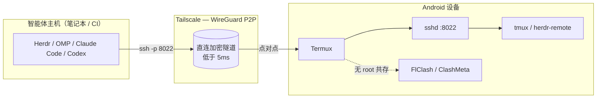

# termux-agent-station

[English](README.md) | [简体中文](README.zh-CN.md)

> **通过 Tailscale 与 Herdr，把任意一部 Android 手机变成延迟低于 5ms 的 AI 编程智能体原生移动工作站。**

`termux-agent-station` 将一台运行 Termux 的闲置 Android 设备，改造成一个持久、省电、基于原生 SSH 的移动工作站，让 AI 编程智能体（Herdr、OMP、Claude Code、Codex）经由 WireGuard 点对点链路直接驱动——无需云端中继、无需屏幕串流、毫无妥协。

---

## 为什么需要它

### 今天「在手机上写代码」的两条弯路
多数人想在手机上写代码时，都会掉进两种陷阱之一：

- **WebRTC / VNC 屏幕串流**：延迟高、耗电快，键盘交互体验更是灾难。每一次按键都是一次像素往返，每一种颜色都要被转码，每一次断线重连都会丢失现场。
- **云端 IDE**：代码离开本机，延迟受制于蜂窝网络，还要为此付费。

### 原生方案
Termux 早已在 Android 上提供了一个完整的 Linux 用户态环境。把它和 **Tailscale**（底层即 WireGuard）以及 **原生 SSH** 结合起来，你将获得：

- ⚡ **低于 5ms 的直接延迟**——点对点 WireGuard，没有中继跳。
- 🎨 **零转码**——原生 VT100，完整支持 16 色与真彩色。
- ⌨️ **真正的键盘体验**——外接键盘、修饰键，以及一套为 AI 智能体调校的触摸扩展键矩阵。
- 🔄 **持久会话**——`tmux` / `herdr-remote` 能扛过网络抖动与应用被杀。

---

## 双轨哲学（Dual-Track Philosophy）

本项目刻意区分「算力的位置」与「人的位置」，这也是整套方案的内核：

**轨道一 · 口袋工作站（Pocket Workstation）= Termux 原生 SSH**
手机就是一台真实的 Linux 盒子。智能体通过原生 SSH 登录进来，在本地编译、跑测试、改文件——所有重负载都发生在手机本地，只把「字符流」而非「画面」传出去。延迟因此被压缩到 WireGuard 直连的物理下限（实测常低于 5ms），电量也只服务于计算本身，而非无谓的画面编码。

**轨道二 · 移动手柄（Mobile Handle）= herdr-chatops**
人不需要守着那块小屏。通过 `herdr-chatops` 这类聊天侧信道，你在任意终端、甚至另一台手机上，用自然语言向工位「发号施令」：查看进度、批准敏感操作、回放日志。手柄与工作站解耦，意味着智能体可以 7×24 在口袋里跑，而你随时用最舒服的设备接管。

两条轨道经由 Tailscale 这一张扁平网络缝合：工作站与手柄看到的，是同一个加密、直连、无公网暴露的虚拟局域网。

---

## 核心特性

| 特性 | 带来的收益 |
| --- | --- |
| 🚀 **低于 5ms 的 WireGuard 延迟** | Tailscale P2P 让智能体主机与手机内核直接对话——无 TURN 中继、无转码。 |
| ⌨️ **触摸优先的扩展键矩阵** | 两行专为 AI 智能体调校的按键：`ESC`、`TAB`、`CTRL`、`ALT`、方向键，以及 `\|`、`_`、`$`、`` ` `` 等长按弹出键。 |
| 🔄 **自动重连与会话持久化** | `herdr-remote` + `tmux` 让智能体的上下文在网络抖动、息屏、Termux 重启后依然存活。 |
| 🎨 **Ghostty 风格现代暗色主题** | 基于 TokyoNight 的配色，在 `vim`、TUI 与智能体输出中提供锐利对比度。 |
| 🛡️ **网络共存（无 root）** | FlClash / ClashMeta 与 Tailscale 并肩运行而无需 root——你的代理路由与 P2P 隧道互不打架。 |
| 🔋 **后台保活与 Wakelock 防御** | 电池优化豁免 + `termux-wake-lock`，让 SSH 服务在口袋里始终在线。 |

---

## 架构



智能体主机通过 SSH 以 `8022` 端口连接手机的 Tailscale IP。Tailscale 建立一条直接的 WireGuard 对等链路（仅在 NAT 穿透失败时回退到中继）。在 Termux 内部，`sshd` 把会话交给 `tmux` / `herdr-remote`，因此即便链路瞬间抖动，智能体仍保留其工作树与滚动缓冲区。

---

## 快速部署

### 一键安装（在 Termux 内执行）

```bash
curl -sSL https://raw.githubusercontent.com/<your-host>/termux-agent-station/main/bin/setup.sh | bash
```

请将 `<your-host>` 替换为你的 GitHub 或 CNB 命名空间（例如 `steven/termux-agent-station`）。

### 手动分步部署

```bash
# 1. 安装前置依赖
pkg update && pkg install -y git tailscale openssh termux-api

# 2. 克隆本仓库
git clone https://github.com/<your-host>/termux-agent-station.git
cd termux-agent-station

# 3. 部署 Termux 配置（扩展键 + 主题）
bash bin/setup.sh

# 4. 启动 Tailscale（无需 root）
tailscale up

# 5. 设置 SSH 密码并启动服务
passwd
sshd   # 监听于 :8022

# 6. 在智能体主机上，经 Tailscale IP 连接
ssh -p 8022 <your-user>@<your-tailscale-ip>
```

> **提示：** 用 `tmux` 包裹会话（`pkg install tmux && tmux new -s agent`），智能体即可扛过一次掉线或 Termux 后台被杀。

### 保活与 Wakelock

```bash
# 将 Termux 加入电池优化豁免，并持有 wakelock
termux-wake-lock
# 设置 → 应用 → Termux → 电池 → 无限制
```

---

## 触摸键盘与手势参考

`configs/termux.properties` 中的扩展键矩阵为智能体操作习惯而排布。**轻点**触发主键，**长按**触发弹出备用键。

| 按键 | 长按弹出 | 用途 |
| --- | --- | --- |
| `ESC` | `FN` | 退出 / 功能层 |
| `TAB` | `\` | 缩进 / 路径分隔转义 |
| `CTRL` | `INSERT` | 复制 / 粘贴 / 快捷键修饰键 |
| `ALT` | `DELETE` | 修饰键 / 快速删除 |
| `UP` | `PGUP` | 滚动 / 上翻页 |
| `DOWN` | `PGDN` | 滚动 / 下翻页 |
| `ENTER` | `KEYBOARD` | 发送换行 / 切换软键盘 |
| `/` | `\|` | 路径分隔 / 管道 |
| `-` | `_` | 连字符 / 下划线 |
| `~` | `$` | 家目录 / 变量符号 |
| `'` | `` ` `` | 引号 / 反引号 |
| `LEFT` | `HOME` | 移动光标 / 跳到行首 |
| `RIGHT` | `END` | 移动光标 / 跳到行尾 |
| `DRAWER` | `KEYBOARD` | 打开扩展键抽屉 / 键盘 |

**手势（Termux 原生）：**

| 手势 | 动作 |
| --- | --- |
| 长按扩展键 | 显示弹出备用键 |
| 点按 `DRAWER` / `KEYBOARD` | 显示或隐藏软键盘 |
| 下拉通知栏 | Termux 磁贴：*获取 wakelock*、*显示键盘* |
| 在终端上双指捏合 | 缩放字号 |
| `音量减` + `c` | 自定义会话快捷键（可配置） |

---

## 配置清单

| 路径 | 作用 |
| --- | --- |
| `configs/termux.properties` | 扩展键矩阵、光标、输入行为 |
| `configs/colors.properties` | TokyoNight 暗色终端配色 |
| `bin/setup.sh` | 上述配置的幂等部署脚本 |
| `.github/workflows/ci.yml` | GitHub Actions ShellCheck 门禁 |
| `.cnb.yml` | 腾讯云 CNB ShellCheck 门禁 |

---

## 许可证

基于 [MIT 许可证](LICENSE) 发布。Copyright (c) 2026 Steven.
